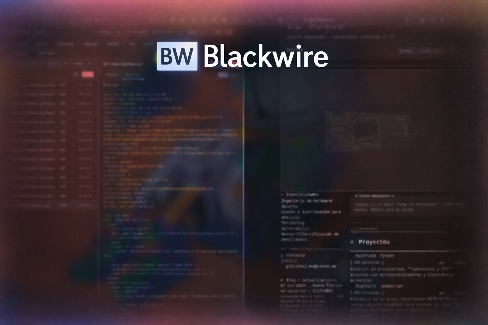

# BlackWire




---

## Descripción

**BlackWire** es un proxy interceptor HTTP/HTTPS de código abierto diseñado para pruebas de seguridad, análisis de tráfico web y debugging de aplicaciones. Ofrece una alternativa ligera, portable y extensible a herramientas como Burp Suite o OWASP ZAP, con un frontend web moderno y un potente backend basado en mitmproxy. Permite interceptar, modificar y reenviar peticiones en tiempo real, gestionar múltiples proyectos, y extender funcionalidades mediante plugins personalizados.

---

## Características

### Core
- **Proxy Interceptor**: Captura y modifica peticiones/respuestas HTTP/HTTPS en tiempo real con soporte para forward, drop y edición completa
- **Gestión de Proyectos**: Organiza sesiones de trabajo con proyectos independientes, cada uno con su propia base de datos SQLite
- **Repeater**: Reenvía y modifica peticiones capturadas con soporte para redirect automático/manual, historial de navegación y auto-guardado
- **Scope/Filtros**: Define reglas include/exclude con regex y wildcards para interceptar solo tráfico relevante

### Análisis
- **HTTPQL**: Lenguaje de consulta inspirado en Caido para filtrar requests con operadores avanzados (eq, cont, like, regex, gt, lt, etc.) sobre campos de request y response
- **Filter Presets**: Guarda y aplica filtros HTTPQL frecuentes desde un dropdown con CRUD completo
- **Compare**: Compara dos requests/responses lado a lado con highlighting de diferencias usando algoritmo LCS (diff)
- **Site Map**: Vista en árbol jerárquico de todos los hosts y endpoints capturados, agrupados por host → path segments
- **WebSocket Viewer**: Captura y visualiza conexiones WebSocket con sus frames en ambas direcciones, con soporte para reenviar mensajes

### Herramientas
- **Cipher**: Encoder/decoder visual con recetas encadenables — Base64, URL encoding, hashes criptográficos, gzip, hex, y 100+ operaciones
- **Collections**: Agrupa requests en secuencias ejecutables con extracción de variables y sustitución automática para workflows de testing
- **Git Integration**: Control de versiones integrado para commits y revisión de historial del proyecto

### Operación
- **100% Portable**: Sin rutas hardcoded, funciona desde cualquier directorio
- **Desktop Launcher**: Integración con menú de aplicaciones sin terminal visible
- **Shutdown**: Botón en la UI, script `stop.sh`, o endpoint API para apagar el server
- **Cross-Platform**: Compatible con cualquier distribución Linux
- **15 Temas**: Midnight, Dusk, Paper, Gruvbox, Solarized, Aurora, Noir, Glacier, Ember, Forest, Oceanic, Rose, Mono, Desert, Synth
=======
## Tabla de Contenidos

- [Características](#-características)
- [Instalación](#-instalación)
  - [Instalación Rápida](#-instalación-rápida)
  - [Requisitos](#-requisitos)
  - [Métodos de Instalación](#-métodos-de-instalación)
  - [Desktop Launcher](#-desktop-launcher)
  - [Certificados SSL](#-certificados-ssl)
- [Uso](#-uso)
  - [Inicio Rápido](#inicio-rápido)
  - [Gestión de Proyectos](#gestión-de-proyectos)
  - [Proxy Interceptor](#proxy-interceptor)
  - [Repeater](#repeater)
  - [Scope](#scope)
  - [Extensiones](#extensiones)
- [Portabilidad](#-portabilidad)
- [Verificación y Troubleshooting](#-verificación-y-troubleshooting)
- [Contribuir](#-contribuir)
- [Créditos](#-créditos)

---

## Características

- **Proxy Interceptor**: Captura y modifica peticiones/respuestas HTTP/HTTPS en tiempo real
- **Gestión de Proyectos**: Organiza tus sesiones de trabajo con proyectos independientes
- **Repeater**: Reenvía y modifica peticiones capturadas para pruebas iterativas
- **Scope/Filtros**: Define reglas de alcance para interceptar solo el tráfico relevante
- **Sistema de Extensiones**: Amplía funcionalidades con plugins personalizados en Python
- **Interface Web Moderna**: Frontend intuitivo accesible desde el navegador
- **100% Portable**: Funciona desde cualquier directorio sin instalación del sistema
- **Base de Datos SQLite**: Cada proyecto almacena su historial localmente
- **Cross-Platform**: Compatible con cualquier distribución Linux

---

## Instalación

### Instalación Rápida

```bash
# 1. Descarga el proyecto
git clone https://github.com/Glitchboi-sudo/Blackwire.git
cd Blackwire
=======
git clone https://github.com/[tu-usuario]/blackwire.git
cd blackwire

# 2. Ejecuta el instalador
chmod +x install.sh
./install.sh

# 3. Lanza la aplicación
./launch-with-browser.sh
```

¡Eso es todo! El instalador se encarga de todo automáticamente.

---

### Requisitos

#### Dependencias del Sistema
```bash
# Ubuntu/Debian
sudo apt install python3 python3-pip python3-venv nodejs npm

# Fedora/RHEL/CentOS
sudo dnf install python3 python3-pip nodejs npm

# Arch Linux
sudo pacman -S python python-pip nodejs npm
```

> **Node.js** es necesario para la pre-transpilación de JSX con sucrase. Si no está disponible, la app funciona igual pero carga más lento (usa Babel en el browser como fallback).

=======
sudo apt install python3 python3-pip python3-venv

# Fedora/RHEL/CentOS
sudo dnf install python3 python3-pip

# Arch Linux
sudo pacman -S python python-pip
```

---

### Métodos de Instalación

#### Método 1: Instalador Automático (Recomendado)

El script `install.sh` realiza todas las configuraciones necesarias:

```bash
chmod +x install.sh
./install.sh
```

**Qué hace el instalador:**
1. Verifica versión de Python (3.8+)
2. Verifica/instala pip
3. Crea entorno virtual
4. Instala dependencias desde requirements.txt
5. Crea directorios necesarios
6. Genera certificados SSL de mitmproxy
7. Hace ejecutables todos los scripts
8. Opcionalmente instala launcher en el menú

#### Método 2: Instalación Manual

Si prefieres control total sobre la instalación:

```bash
# 1. Crear entorno virtual
python3 -m venv venv

# 2. Activar entorno
source venv/bin/activate

# 3. Actualizar pip
pip install --upgrade pip

# 4. Instalar dependencias
pip install -r requirements.txt

# 5. Instalar sucrase para transpilación JSX (opcional pero recomendado)
npm install --save-dev sucrase

# 6. Crear directorios
mkdir -p data projects

# 7. Hacer scripts ejecutables
chmod +x *.sh

# 8. Iniciar
=======
# 5. Crear directorios
mkdir -p data projects

# 6. Hacer scripts ejecutables
chmod +x *.sh

# 7. Iniciar
./launch-with-browser.sh
```

---

### Desktop Launcher
=======
### 🖥️ Desktop Launcher

#### Instalar Launcher en el Menú

```bash
./install-desktop.sh
```

Después de instalarlo, puedes:
- Buscar "Blackwire" en el menú de aplicaciones
- Fijarlo al dock/panel
- Asignarle un atajo de teclado

El launcher inicia el server en background y abre el navegador automáticamente. No se queda ninguna terminal abierta.

=======
#### Desinstalar Launcher

```bash
./uninstall-desktop.sh
```

---

### Certificados SSL

BlackWire usa **mitmproxy** para interceptar tráfico HTTPS. Necesitas instalar el certificado CA:

#### Ubicación del Certificado

```bash
~/.mitmproxy/mitmproxy-ca-cert.pem
```

#### Instalar en Navegador

**Firefox:**
1. Preferencias → Privacidad y Seguridad → Certificados → Ver Certificados
2. Autoridades → Importar
3. Selecciona: `~/.mitmproxy/mitmproxy-ca-cert.pem`
4. Confía para: "Identificar sitios web"

**Chrome/Chromium:**
1. Configuración → Privacidad y Seguridad → Seguridad → Gestionar certificados
2. Autoridades → Importar
3. Selecciona: `~/.mitmproxy/mitmproxy-ca-cert.pem`

**Sistema (Linux):**
```bash
# Ubuntu/Debian
sudo cp ~/.mitmproxy/mitmproxy-ca-cert.pem /usr/local/share/ca-certificates/mitmproxy.crt
sudo update-ca-certificates

# Fedora/RHEL
sudo cp ~/.mitmproxy/mitmproxy-ca-cert.pem /etc/pki/ca-trust/source/anchors/
sudo update-ca-trust
```

---

## Uso

### Inicio y Parada

```bash
# Iniciar (abre navegador automáticamente)
./launch-with-browser.sh

# Iniciar sin navegador
./start.sh

# Parar el server
./stop.sh
```

También puedes apagar desde la interfaz web con el botón ⏻ en la esquina superior derecha, o vía API:
```bash
curl -X POST http://localhost:5000/api/shutdown
=======
### Inicio Rápido

```bash
# Opción 1: Launcher automático (abre navegador)
./launch-with-browser.sh

# Opción 2: Start manual
./start.sh
```

Una vez iniciado:
- **Frontend**: http://localhost:5000
- **API Docs**: http://localhost:5000/docs
- **Proxy**: http://localhost:8080 (configura este proxy en tu navegador/herramienta)

---

### Proxy Interceptor

1. **Iniciar Proxy**: Botón "▶ Start" en la interfaz
=======
- **Proxy**: http://localhost:8080 (configura este proxy en tu navegador/herramienta)

### Gestión de Proyectos

BlackWire organiza el trabajo en **proyectos** independientes. Cada proyecto tiene su propia base de datos y configuración.

**Funcionalidades:**
- Crear/eliminar proyectos
- Cambiar entre proyectos activos
- Exportar/importar datos de proyectos
- Cada proyecto mantiene su propio historial aislado

### Proxy Interceptor

1. **Iniciar Proxy**: Botón "Start Proxy" en la interfaz
2. **Configurar Navegador**: Proxy HTTP en `localhost:8080`
3. **Habilitar Intercept**: Activa el interceptor para pausar peticiones
4. **Modificar Peticiones**: Edita headers, body, método, URL
5. **Forward/Drop**: Envía o descarta la petición modificada

Soporta modos: regular, upstream, socks5, reverse, transparent.

---
=======
**Características:**
- Intercepta HTTP y HTTPS
- Modifica peticiones y respuestas en tiempo real
- Historial completo de tráfico
- Búsqueda y filtrado de peticiones
- Exportación de datos

### Repeater

Reenvía peticiones capturadas para pruebas iterativas:

1. Click derecho en una petición → "Send to Repeater" (o botón "→ Rep")
2. Modifica método, URL, headers o body
3. Click "Send" para enviar
4. Inspecciona headers y body de la respuesta
5. Pretty Print / Minify para formatear

**Características:**
- Historial de navegación por request (atrás/adelante)
- Auto-guardado de requests
- Modo redirect: No Redirect (manual) o Auto Follow
- Visualización de redirect chain completa
- Colorización de sintaxis en body (JSON, HTML, XML)

---

### HTTPQL - Filtrado Avanzado

El campo de búsqueda en History soporta HTTPQL, un lenguaje de consulta para filtrar requests:

```
# Filtrar por método
req.method eq GET

# Filtrar por host
req.host cont example.com

# Filtrar por status code
resp.code gte 400

# Combinar con operadores lógicos
req.method eq POST AND resp.code eq 200

# Usar regex
req.path regex /api/v[0-9]+/users

# Negar
NOT req.host cont google.com

# Agrupar
(req.method eq POST OR req.method eq PUT) AND resp.code lt 300
```

**Campos disponibles:**
- Request: `method`, `host`, `path`, `port`, `ext`, `query`, `raw`, `len`, `tls`
- Response: `code`, `raw`, `len`

**Operadores:**
- String: `eq`, `ne`, `cont`, `ncont`, `like`, `nlike`, `regex`, `nregex`
- Numéricos: `eq`, `ne`, `gt`, `gte`, `lt`, `lte`

**Filter Presets**: Guarda queries frecuentes con nombre para acceso rápido desde el dropdown.

---

### Compare

Compara dos requests o responses lado a lado con diff visual:

1. Click derecho en un request → "Compare (A)" para establecer el lado izquierdo
2. Click derecho en otro → "Compare (B)" para el lado derecho
3. Ve a la pestaña Compare
4. Alterna entre vista de Request y Response
5. Las diferencias se resaltan: verde = añadido, rojo = eliminado

---

### Site Map

Vista en árbol de todos los hosts y endpoints capturados:

1. Ve a History → sub-tab "Site Map"
2. El panel izquierdo muestra el árbol: Host → /path → /subpath
3. Click en un nodo para ver sus requests
4. Click en un request para ver su detalle completo

Los nodos muestran badges con el conteo de requests y los métodos HTTP vistos (GET, POST, etc.).

---

### Cipher

Encoder/decoder con recetas encadenables:

1. Ingresa datos en el panel de input
2. Busca y agrega operaciones desde la lista (Base64, URL encode, SHA256, etc.)
3. Las operaciones se encadenan: la salida de una es la entrada de la siguiente
4. El resultado aparece en el panel de output
5. Configura parámetros por operación cuando aplique

**Categorías de operaciones:**
- Encoding: Base64, URL, Hex, HTML entities
- Hashing: MD5, SHA1, SHA256, SHA512, HMAC
- Compression: Gzip compress/decompress
- Encryption: AES, DES, 3DES, Blowfish, RC4, ChaCha20, XOR
- Conversión: Decimal, Octal, Binary, Morse, ROT13
- String: Reverse, Upper/Lower, Count, Length, Split, Replace
- Y más...

---

### Collections

Agrupa requests en secuencias ejecutables con variables:

1. Crea una colección con nombre
2. Agrega requests desde el context menu → "Add to Collection"
3. Configura extractores de variables (extraer tokens, IDs, etc. de responses)
4. Ejecuta la secuencia — las variables se sustituyen automáticamente
5. Revisa resultados de cada paso

Ideal para testing de flujos multi-paso como login → obtener token → usar token.

---

### WebSocket Viewer

Captura y visualiza tráfico WebSocket:

1. Ve a History → sub-tab "WS"
2. Panel izquierdo: lista de conexiones WebSocket por URL
3. Panel central: frames de la conexión seleccionada (↑ enviado, ↓ recibido)
4. Panel derecho: detalle del frame seleccionado
5. Reenvía frames editados con el campo de input

---

### Webhook.site

Captura webhooks entrantes:

1. Ve a la pestaña Webhook
2. Genera un token para obtener una URL única de webhook.site
3. Usa esa URL como callback en tus pruebas
4. Los requests entrantes aparecen automáticamente en la lista
5. Inspecciona headers, body y metadata de cada webhook

---

### Temas

BlackWire incluye 15 temas de color:

| Tema | Estilo |
|------|--------|
| Midnight | Oscuro azul (default) |
| Dusk | Oscuro púrpura |
| Paper | Claro cálido |
| Gruvbox | Retro cálido |
| Solarized | Claro precision |
| Aurora | Oscuro azul profundo |
| Noir | Negro puro |
| Glacier | Oscuro azul hielo |
| Ember | Oscuro rojo cálido |
| Forest | Oscuro verde |
| Oceanic | Oscuro azul océano |
| Rose | Oscuro rosa |
| Mono | Oscuro desaturado |
| Desert | Oscuro arena |
| Synth | Oscuro neón púrpura |

Selecciona el tema desde el dropdown en la esquina superior derecha. La preferencia se guarda en localStorage.

---
=======
1. Selecciona una petición del historial
2. Envíala al Repeater
3. Modifica parámetros, headers o body
4. Reenvía múltiples veces
5. Compara respuestas

Ideal para:
- Testing de parámetros
- Fuzzing manual
- Bypass de validaciones
- Análisis de respuestas

### Scope

Define reglas para filtrar qué tráfico interceptar:

```
Include: *.example.com/*      (solo example.com)
Exclude: *.google.com/*       (ignora Google)
Include: /api/.*              (solo endpoints de API)
=======
```json
{
  "pattern": "example.com",
  "rule_type": "include",
  "enabled": true
}
```

**Tipos de reglas:**
- **Include**: Solo intercepta URLs que coincidan
- **Exclude**: Ignora URLs que coincidan
- Soporta regex y wildcards

También puedes agregar hosts al scope directamente desde el context menu sobre cualquier request.

---
=======
**Ejemplo:**
```
Include: *.example.com/*      (solo example.com)
Exclude: *.google.com/*       (ignora Google)
Include: /api/.*              (solo endpoints de API)
```

### Extensiones

BlackWire soporta plugins personalizados en Python para extender funcionalidades.

**Ubicación:** `backend/extensions/`

**Ejemplo de extensión:**
```python
# backend/extensions/mi_extension.py

def on_request(flow):
    """Se ejecuta en cada petición"""
    if "Authorization" in flow.request.headers:
        print(f"Token detectado: {flow.request.headers['Authorization']}")

def on_response(flow):
    """Se ejecuta en cada respuesta"""
    if flow.response.status_code == 500:
        print(f"Error 500 en: {flow.request.url}")
```

**Hooks disponibles:**
- `on_request(flow)`: Antes de enviar la petición
- `on_response(flow)`: Después de recibir la respuesta
- `on_error(flow)`: Cuando hay un error

Las extensiones tienen acceso completo al objeto `flow` de mitmproxy.

---

### Git Integration

Control de versiones integrado para el proyecto:

1. Ve a la pestaña Git
2. Escribe un mensaje de commit
3. Realiza commits del estado actual del proyecto
4. Revisa el historial de commits

---

## Arquitectura

```
Blackwire/
├── backend/
│   ├── main.py              # API FastAPI + servidor principal
│   ├── frontend.html         # HTML con CSS embebido
│   ├── extensions/           # Plugins Python
│   └── chepy_compat.py       # Motor de operaciones Cipher
├── frontend/
│   ├── App.jsx               # Aplicación React completa (~3400 líneas)
│   ├── App.compiled.js       # JSX pre-transpilado (generado automáticamente)
│   ├── themes.js             # Definiciones de temas
│   └── index.html            # HTML standalone
├── projects/                 # Bases de datos SQLite por proyecto
├── launch-with-browser.sh    # Launcher principal (sin terminal)
├── start.sh                  # Inicio manual
├── stop.sh                   # Parar el server
├── install.sh                # Instalador automático
├── install-desktop.sh        # Instalar launcher en menú
└── requirements.txt          # Dependencias Python
```

**Stack tecnológico:**
- **Backend**: Python 3.8+ / FastAPI / Uvicorn
- **Proxy Engine**: mitmproxy
- **Frontend**: React 18 (single-file, pre-transpilado con Sucrase)
- **Database**: SQLite (una DB por proyecto)
- **Compression**: GZip middleware

---

=======
## Portabilidad

BlackWire es **100% portable**. Todos los scripts detectan automáticamente su ubicación.

### Mover a otro directorio
```bash
mv Blackwire /opt/Blackwire
cd /opt/Blackwire
./launch-with-browser.sh
```

### Copiar a otra máquina
```bash
# En máquina origen
tar -czf blackwire.tar.gz Blackwire/

# En máquina destino
tar -xzf blackwire.tar.gz
cd Blackwire
./install.sh
```

### Reinstalar desktop launcher tras mover
=======
### Características Portables

- **Detección Automática de Rutas**: Sin rutas hardcoded
- **Desktop Launcher Dinámico**: Se actualiza automáticamente
- **Sin Dependencias del Sistema**: Todo en el directorio del proyecto

### Ejemplos de Uso Portable

**Mover a otro directorio:**
```bash
mv blackwire /opt/blackwire
cd /opt/blackwire
./launch-with-browser.sh
```

**Copiar a otra máquina:**
```bash
# En máquina origen
tar -czf blackwire.tar.gz blackwire/

# En máquina destino
tar -xzf blackwire.tar.gz
cd blackwire
./install.sh
```

**Ejecutar desde USB:**
```bash
cd /media/usb/blackwire
./launch-with-browser.sh
```

**Reinstalar desktop launcher tras mover:**
```bash
./uninstall-desktop.sh
./install-desktop.sh
```

### Limitaciones

⚠️ **Entorno Virtual no portable**: El `venv/` contiene rutas absolutas. Solución: `rm -rf venv && ./install.sh`

⚠️ **Desktop Launcher**: Actualizar después de mover el proyecto con `./uninstall-desktop.sh && ./install-desktop.sh`
=======
⚠️ **Entorno Virtual no portable**: El `venv/` contiene rutas absolutas.

**Solución:**
```bash
rm -rf venv
./install.sh
```

⚠️ **Desktop Launcher**: Actualizar después de mover el proyecto.

**Solución:**
```bash
./uninstall-desktop.sh
./install-desktop.sh
```

---

## Verificación y Troubleshooting

### Verificar Instalación

```bash
=======
python3 --version
# Debe ser ≥ 3.8

source venv/bin/activate
pip list | grep -E "(fastapi|mitmproxy|uvicorn)"
./verify-install.sh
```

### Troubleshooting Común

| Problema | Solución |
|----------|----------|
| Python version too old | Instala Python 3.8+ o usa pyenv |
| pip not found | `sudo apt install python3-pip` |
| Permission denied | `chmod +x *.sh` |
| Port 5000 in use | `lsof -i :5000` → `kill <PID>`, o usa `./stop.sh` |
| Port 8080 in use | `lsof -i :8080` → `kill <PID>` |
| Certificado no funciona | `rm -rf ~/.mitmproxy && ./install.sh` |
| App carga lento | Verifica que Node.js/npm están instalados para pre-transpilación |
| Server no para | `./stop.sh` o `curl -X POST http://localhost:5000/api/shutdown` |

---

## API

La documentación interactiva del API está disponible en http://localhost:5000/docs cuando el server está corriendo.

**Endpoints principales:**
- `GET /api/projects` — Listar proyectos
- `POST /api/requests/search` — Buscar requests con HTTPQL
- `GET /api/requests/{id}/detail` — Detalle completo de un request
- `POST /api/repeater/send-raw` — Enviar request desde Repeater
- `GET /api/scope` — Obtener reglas de scope
- `POST /api/chepy/bake` — Ejecutar receta de Cipher
- `GET /api/websocket/connections` — Listar conexiones WS
- `POST /api/shutdown` — Apagar el server
=======
#### Problema: Python version too old

```bash
# Solución: Instala Python 3.8+ o usa pyenv
curl https://pyenv.run | bash
pyenv install 3.11.0
pyenv local 3.11.0
```

#### Problema: pip not found

```bash
# Ubuntu/Debian
sudo apt install python3-pip

# get-pip
curl https://bootstrap.pypa.io/get-pip.py -o get-pip.py
python3 get-pip.py --user
```

#### Problema: Permission denied

```bash
# Haz los scripts ejecutables
chmod +x *.sh
sudo chown -R $USER:$USER .
```

#### Problema: Port already in use

```bash
# Backend (5000)
lsof -i :5000
kill -9 <PID>

# Proxy (8080)
lsof -i :8080
kill -9 <PID>
```

#### Problema: Certificado no funciona

```bash
# Regenera certificados
rm -rf ~/.mitmproxy
./install.sh  # Los regenera automáticamente
```

---

## Contribuir

Este proyecto es un espacio abierto para aprender, experimentar y construir juntos. **Buscamos activamente contribuciones**:

- **Funcionalidades**: Ideas para nuevas características, integraciones, mejoras en el interceptor
- **Código**: Corrección de bugs, optimización de rendimiento, mejoras en legibilidad
- **Extensiones**: Plugins para automatizar tareas de pentesting o análisis
- **Temas**: Nuevos esquemas de color para la interfaz

No necesitas ser experto para ayudar. Si crees que algo puede explicarse mejor o hacerse de forma más elegante, **abre un Pull Request**.
=======
Este proyecto no solo es un repositorio: es un espacio abierto para aprender, experimentar y construir juntos. **Buscamos activamente contribuciones**, ya sea en la parte técnica o incluso en la documentación.

- **En funcionalidades:** Si tienes ideas para nuevas características (integraciones con otras herramientas, mejoras en el interceptor, nuevos tipos de análisis), ¡compártelas!
- **En software:** Desde corrección de bugs, optimización de rendimiento, hasta mejoras en la legibilidad del código o documentación; todo aporte, grande o pequeño, suma muchísimo.
- **En extensiones:** Crea y comparte plugins para automatizar tareas específicas de pentesting o análisis.

No necesitas ser experto para ayudar: si crees que algo puede explicarse mejor, que el código puede ser más claro, o que hay una forma más elegante de hacer algo, **cuéntanos o abre un Pull Request**.

---

## Créditos

Proyecto inspirado en [Burp Suite](https://portswigger.net/burp), [OWASP ZAP](https://www.zaproxy.org/), [mitmproxy](https://mitmproxy.org/) y [Caido](https://caido.io/).

Creado por **[Erik Alcantara](https://www.linkedin.com/in/erik-alc%C3%A1ntara-covarrubias-29a97628a/)**.

**Tecnologías:**
- [mitmproxy](https://mitmproxy.org/) — Motor de proxy
- [FastAPI](https://fastapi.tiangolo.com/) — Backend API
- [React](https://react.dev/) — Frontend
- [Sucrase](https://github.com/alangpierce/sucrase) — Transpilación JSX
- [SQLite](https://www.sqlite.org/) — Base de datos
=======
Proyecto inspirado en herramientas como [Burp Suite](https://portswigger.net/burp), [OWASP ZAP](https://www.zaproxy.org/) y [mitmproxy](https://mitmproxy.org/).

Creado por **[Erik Alcantara](https://www.linkedin.com/in/erik-alc%C3%A1ntara-covarrubias-29a97628a/)**.

**Tecnologías utilizadas:**
- [mitmproxy](https://mitmproxy.org/) - Motor de proxy interceptor
- [FastAPI](https://fastapi.tiangolo.com/) - Backend API
- [React](https://react.dev/) - Frontend web
- [SQLite](https://www.sqlite.org/) - Base de datos
